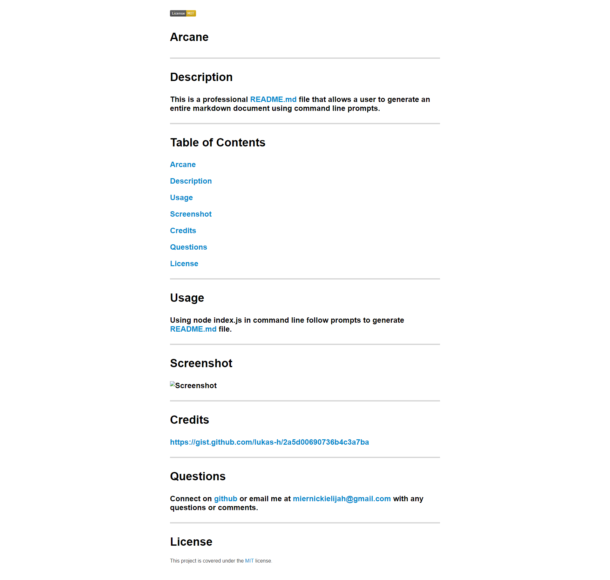

#Arcane
-------------
#Description  
This is a markdown generator that allows a user to create an entire README document via node js
-------------
#Table of Contents  
[Arcane](#Arcane)
[Description](#Description)
[Usage](#Usage)
[Screenshot](#Screenshot)
[Credits](#Credits)
[Questions](#Questions)
[License](#License)
--------------
#Usage  
in command line insert node index.js, then follow these prompts
--------------
#Screenshot  

--------------
#Credits  
--------------
#Questions  
Connect on [github](github.com/miernickielijah) or email me at miernickielijah@gmail.com with any questions or comments. 
--------------
#License  
This project is covered under the [MIT](https://choosealicense.com/licenses/mit/) license.